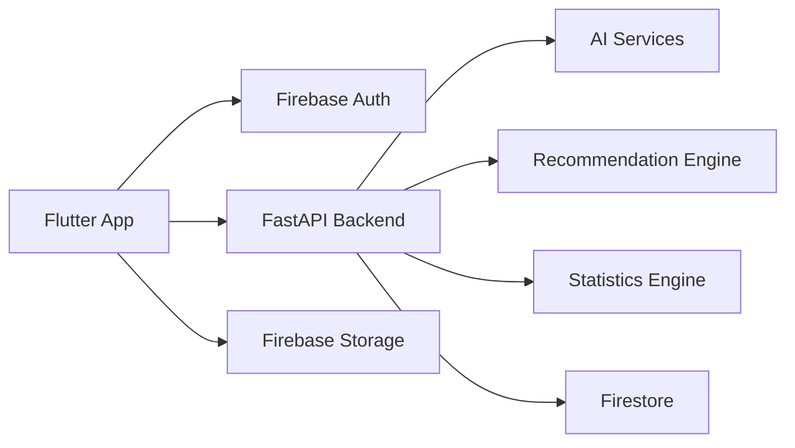
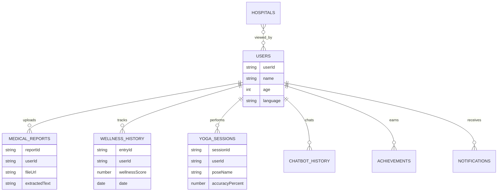
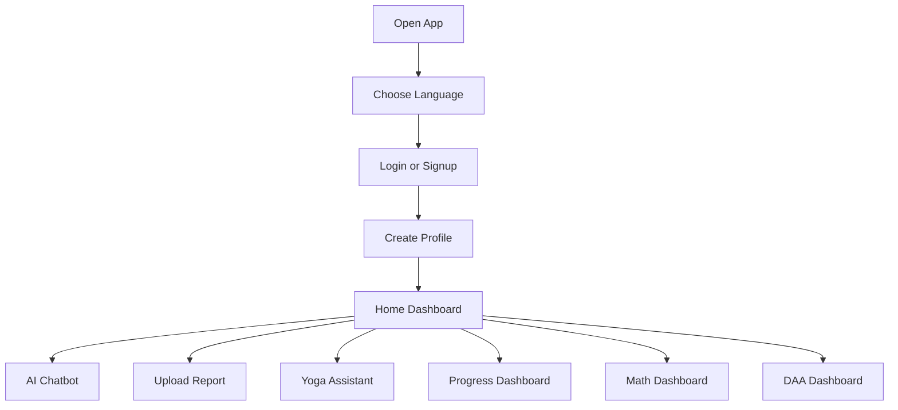
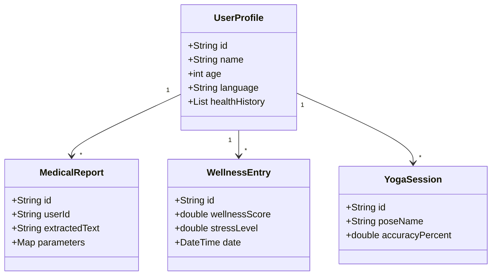
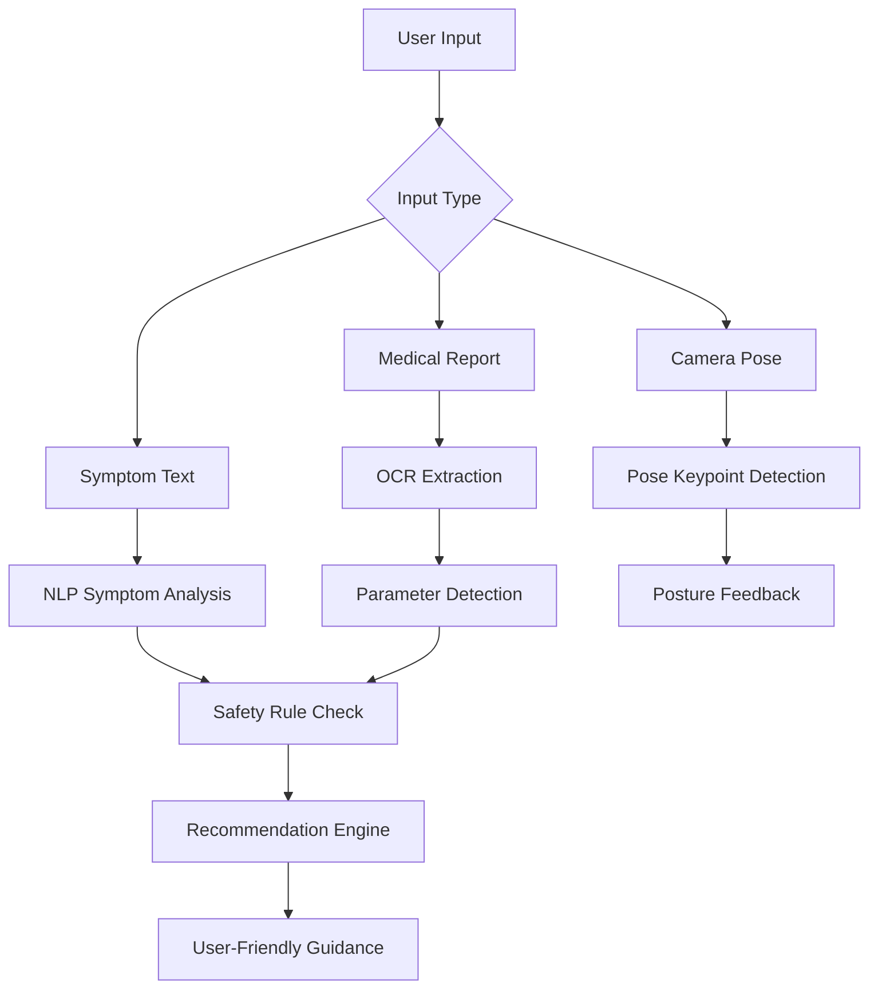
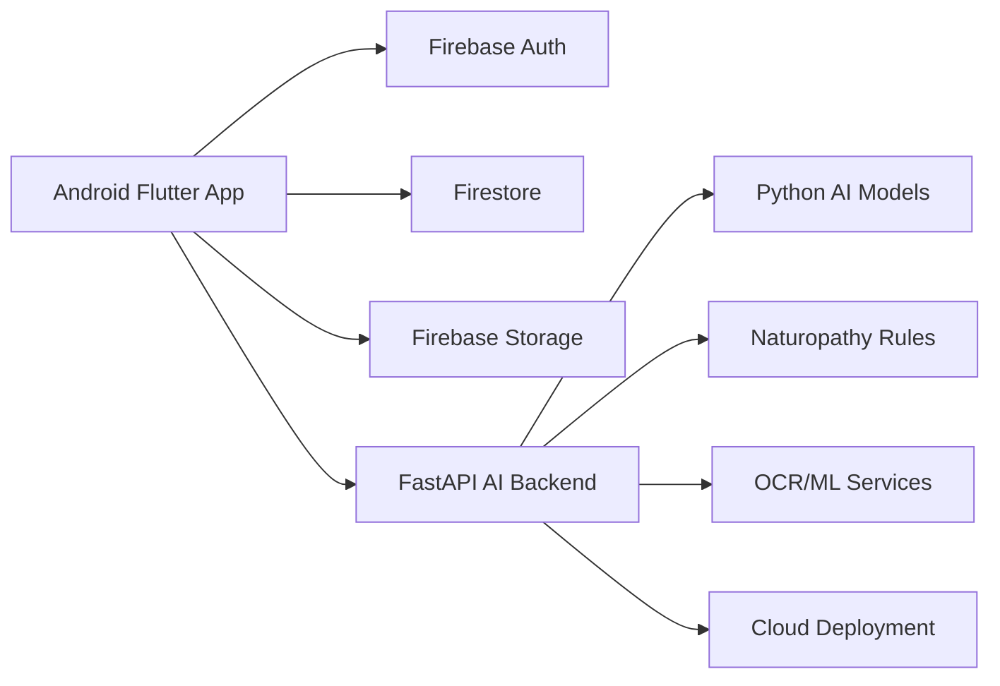

# HealWise AI Architecture Blueprint

## 1. Product Vision

HealWise AI is a startup-style multilingual naturopathy healthcare and wellness
platform. The app focuses on preventive care, natural wellness routines, medical
report understanding, yoga guidance, progress tracking, and academic dashboards
for mathematical and algorithm analysis.

Important health rule: HealWise AI must not tell users to stop prescribed
medicine. It can provide wellness education, natural lifestyle suggestions, and
doctor consultation warnings.

## 2. Phase Plan

### Phase 1: Foundation

- Authentication UI
- Language selection
- English and Kannada text structure
- Home dashboard
- Profile form
- Basic navigation

### Phase 2: AI Wellness Guidance

- Symptom chatbot UI
- Quick symptom chips
- Safety warning logic
- Report upload screen
- OCR text extraction
- Basic report explanation

### Phase 3: Advanced Wellness Modules

- Yoga camera screen
- Pose detection integration
- Audio guidance
- Video guidance
- Routine planner
- Achievement system

### Phase 4: Analytics And Education

- Progress dashboard
- FL Chart graphs
- Mathematical dashboard
- DAA dashboard
- Algorithm visualizations

### Phase 5: Production

- Firebase authentication
- Firestore rules
- Backend API deployment
- AI service deployment
- Testing
- Performance optimization

## 3. Flutter Architecture

Recommended architecture:

```text
lib/
  main.dart
  app/
    healwise_app.dart
    app_routes.dart
  core/
    constants/
    errors/
    localization/
    network/
    theme/
    utils/
    widgets/
  features/
    auth/
      data/
      domain/
      presentation/
    language/
      data/
      domain/
      presentation/
    home/
      data/
      domain/
      presentation/
    chatbot/
      data/
      domain/
      presentation/
    reports/
      data/
      domain/
      presentation/
    recommendations/
      data/
      domain/
      presentation/
    yoga/
      data/
      domain/
      presentation/
    media_guidance/
      data/
      domain/
      presentation/
    hospitals/
      data/
      domain/
      presentation/
    routine_planner/
      data/
      domain/
      presentation/
    progress/
      data/
      domain/
      presentation/
    achievements/
      data/
      domain/
      presentation/
    math_dashboard/
      data/
      domain/
      presentation/
    daa_dashboard/
      data/
      domain/
      presentation/
```

Meaning of each layer:

- `presentation`: screens, widgets, controllers, UI state.
- `domain`: models, entities, business rules, use cases.
- `data`: Firebase/API calls, DTOs, repositories.
- `core`: shared app code used by many features.

## 4. Package Plan

Install packages only when the phase needs them.

### Phase 1

```bash
flutter pub add flutter_riverpod
```

### Phase 2

```bash
flutter pub add image_picker file_picker google_mlkit_text_recognition
```

### Firebase

```bash
flutter pub add firebase_core firebase_auth cloud_firestore firebase_storage
dart pub global activate flutterfire_cli
flutterfire configure
```

### Phase 3

```bash
flutter pub add camera video_player just_audio speech_to_text flutter_tts
```

### Phase 4

```bash
flutter pub add fl_chart
```

### Hospitals And Maps

```bash
flutter pub add geolocator google_maps_flutter
```

## 5. Backend Architecture

Use FastAPI for the AI backend.

```text
backend/
  app/
    main.py
    api/
      routes_chatbot.py
      routes_reports.py
      routes_recommendations.py
      routes_yoga.py
      routes_analytics.py
    core/
      config.py
      security.py
    models/
      request_models.py
      response_models.py
    services/
      chatbot_service.py
      ocr_service.py
      recommendation_service.py
      wellness_score_service.py
      pose_analysis_service.py
      statistics_service.py
    data/
      naturopathy_rules.json
      symptom_safety_rules.json
```

### Main API Flow



## 6. API Design

Suggested endpoints:

```text
POST /chat/symptom
POST /reports/analyze
POST /recommendations/generate
POST /yoga/analyze-frame
POST /wellness/score
GET  /hospitals/nearby
GET  /analytics/progress/{userId}
GET  /education/math
GET  /education/daa
```

Example chatbot request:

```json
{
  "userId": "abc123",
  "language": "en",
  "symptoms": ["stress", "poor sleep"],
  "age": 22,
  "healthHistory": ["mild bp"]
}
```

Example response:

```json
{
  "summary": "Your symptoms may be related to stress and sleep imbalance.",
  "recommendations": [
    "Try 5 minutes of deep breathing twice daily.",
    "Do light evening stretching.",
    "Avoid caffeine after 6 PM."
  ],
  "safetyWarning": "Consult a doctor if symptoms are severe or persistent."
}
```

## 7. Database Schema

Use Firestore collections first. Move to MongoDB later only if the backend needs
more complex document querying.

```text
users/{userId}
  name
  age
  gender
  height
  weight
  language
  healthHistory[]
  lifestyleHabits[]
  createdAt

medical_reports/{reportId}
  userId
  fileUrl
  extractedText
  parameters
  explanation
  createdAt

wellness_history/{entryId}
  userId
  wellnessScore
  stressLevel
  sleepHours
  waterIntake
  yogaMinutes
  date

yoga_sessions/{sessionId}
  userId
  poseName
  durationSeconds
  accuracyPercent
  feedback
  createdAt

chatbot_history/{messageId}
  userId
  language
  userMessage
  aiResponse
  safetyLevel
  createdAt

hospitals/{hospitalId}
  name
  doctorName
  phone
  address
  latitude
  longitude
  rating
  type

achievements/{achievementId}
  userId
  badgeName
  category
  unlockedAt

notifications/{notificationId}
  userId
  title
  body
  read
  createdAt
```

## 8. ER Diagram



## 9. User Flow



## 10. UML Class Diagram



## 11. UI Wireframes

### Language Selection

```text
+--------------------------------+
| HealWise AI logo               |
|                                |
| Smart naturopathy wellness     |
| assistant                      |
|                                |
| Choose your language           |
| [ Continue in English ]        |
| [ Continue in Kannada ]        |
+--------------------------------+
```

### Home Dashboard

```text
+--------------------------------+
| HealWise AI              EN    |
| Wellness Score: 82             |
| Daily quote                    |
|                                |
| [AI Chatbot] [Upload Report]   |
| [Yoga]       [Audio Guide]     |
| [Hospitals]  [Progress]        |
| [Math]       [DAA]             |
+--------------------------------+
```

### Chatbot

```text
+--------------------------------+
| AI Therapy Chatbot             |
| [Headache] [Stress] [Sleep]    |
|                                |
| User: I have stress            |
| AI: Try breathing...           |
|                                |
| [ Type message...        mic ] |
+--------------------------------+
```

### Report Analyzer

```text
+--------------------------------+
| Medical Report Analyzer        |
| [Upload PDF] [Scan Camera]     |
| Extracted values               |
| - Sugar                        |
| - BP                           |
| - Cholesterol                  |
| Simplified explanation         |
+--------------------------------+
```

### Yoga Assistant

```text
+--------------------------------+
| Yoga Posture Detection         |
| Camera preview + skeleton      |
| Accuracy: 86%                  |
| Status: Correct posture        |
| [Start] [Pause] [Finish]       |
+--------------------------------+
```

## 12. AI Workflow



## 13. Wellness Scoring

Initial simple score:

```text
wellnessScore =
  sleepScore * 0.25 +
  stressScore * 0.25 +
  activityScore * 0.20 +
  hydrationScore * 0.15 +
  consistencyScore * 0.15
```

Keep this transparent for academic explanation. Later, replace or improve it
with ML-based prediction.

## 14. Mathematical Dashboard Design

Separate route: `/math-dashboard`

Sections:

- Mean, variance, standard deviation
- Probability distributions
- Confidence intervals
- Hypothesis testing
- Sampling theory
- Markov chains

Healthcare examples:

- Stress probability analysis
- Therapy effectiveness comparison
- Sleep improvement analysis
- Wellness prediction

Graphs:

- Bell curve
- Bar chart
- Pie chart
- Line chart
- Markov transition graph

## 15. DAA Dashboard Design

Separate route: `/daa-dashboard`

Sections:

- Divide and conquer: split medical report into sections.
- Greedy method: rank urgent wellness suggestions.
- Dynamic programming: optimize daily wellness routine.
- Backtracking: generate valid routine combinations.
- Branch and bound: choose best plan under time limits.
- Graph algorithms: nearby hospital navigation.
- Sorting algorithms: rank hospitals by distance or rating.
- Searching algorithms: search symptoms and remedies.

Each algorithm screen:

- Concept
- HealWise use case
- Pseudocode
- Time complexity
- Space complexity
- Visual flow
- Performance graph

## 16. Deployment Architecture



Recommended deployment:

- Flutter Android APK or Play Store.
- Firebase Auth, Firestore, Storage.
- FastAPI hosted on Render, Railway, Google Cloud Run, or AWS.
- AI models stored on backend server or cloud storage.

## 17. Beginner Build Order

Do not start with pose detection or full AI. Build in this order:

1. Home dashboard.
2. Authentication screens.
3. Profile form.
4. Language switching.
5. Static chatbot UI.
6. Rule-based chatbot responses.
7. Report upload UI.
8. OCR extraction.
9. Firebase save/read.
10. Progress charts.
11. Audio/video module.
12. Maps module.
13. Yoga camera module.
14. Python AI backend.
15. Mathematical dashboard.
16. DAA dashboard.

This order prevents the project from becoming too complex too early.
